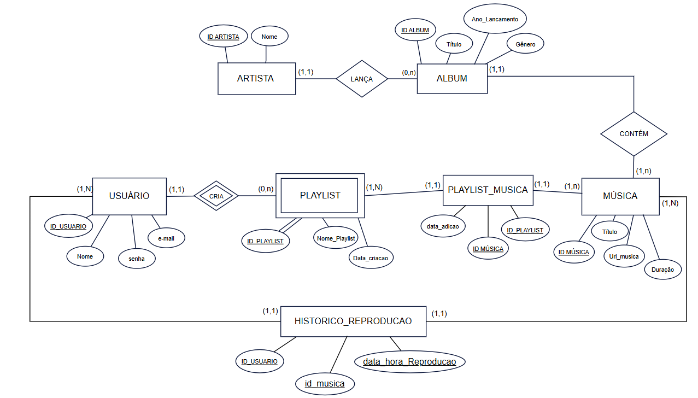

# MediaPlayerBDProject - Sistema de Streaming Musical

> *Desenvolvido para a disciplina de **Banco de Dados I** - UFAPE*\
> **Docente**: Priscilla Kelly Machado Vieira Azevedo
 

## 📋 Sobre o Projeto

Este projeto implementa um banco de dados relacional para um sistema de streaming de música, seguindo as regras de transformação de um Modelo Entidade-Relacionamento Estendido (MERE) para um banco de dados relacional.

**Tecnologias**: PostgreSQL 15, Java Spring Boot, JPA/Hibernate, Maven, React, Vite, Axios, Docker, Docker Compose

## 📑 Índice

- [Como Rodar o Projeto](#-como-rodar-o-projeto)
- [Esquema Conceitual (MERE)](#️-esquema-conceitual-mere)
- [Dicionário de Dados](#-dicionário-de-dados)
- [Normalização](#-normalização)
- [Povoamento do Banco](#-povoamento-do-banco-de-dados)
- [Índices e Otimização](#-índices-e-otimização)
- [Estrutura do Projeto](#-estrutura-do-projeto)
- [Consultas SQL Úteis](#-consultas-sql-úteis)

## 🚀 Como Rodar o Projeto

### Pré-requisitos
- Docker Desktop Instalado

### Comandos para Executar

```bash
# Iniciar o container PostgreSQL
docker-compose up -d

# Executar os scripts de criação do schema
docker exec -i projeto-postgres psql -U admin -d musical < db/schema/init.sql

# (Opcional) Povoar com dados de teste
docker exec -i projeto-postgres psql -U admin -d musical < db/seed/populate_50plus.sql
```

### Acessar o Backend

O Front estará disponível em **localhost:8080**

### Acessar o Frontend

O Front estará disponível em **localhost:5173**

### Acessar o Banco de Dados

O PostgreSQL estará disponível em **localhost:5432**

- **Usuário**: admin
- **Senha**: adminpassword
- **Database**: musical

Você pode conectar usando DBeaver, pgAdmin ou qualquer cliente PostgreSQL.

### Parar o Container

```bash
docker-compose down
```

## 🗂️ Esquema Conceitual (MERE)



### Entidades Principais

```
ARTISTA (id_artista, nome)
    ↓ (1:N)
ALBUM (id_album, titulo, ano_lancamento, genero, id_artista)
    ↓ (1:N)
MUSICA (id_musica, titulo, duracao, url_musica, id_album)

USUARIO (id_usuario, nome, email, senha)
    ↓ (1:N)
PLAYLIST (id_playlist, nome_playlist, data_criacao, id_usuario)

PLAYLIST ←(N:M)→ MUSICA (via PLAYLIST_MUSICA)

USUARIO ←(N:M)→ MUSICA (via HISTORICO_REPRODUCAO)
```

### Relacionamentos

- **ARTISTA → ALBUM**: Um artista pode ter vários álbuns (1:N)
- **ALBUM → MUSICA**: Um álbum contém várias músicas (1:N)
- **USUARIO → PLAYLIST**: Um usuário pode criar várias playlists (1:N)
- **PLAYLIST ↔ MUSICA**: Uma playlist pode ter várias músicas e uma música pode estar em várias playlists (N:M)
- **USUARIO ↔ MUSICA**: Um usuário pode reproduzir várias músicas e uma música pode ser reproduzida por vários usuários (N:M com histórico temporal)

## 📊 Dicionário de Dados

### Tabela: ARTISTA
**Descrição**: Armazena informações sobre artistas/bandas musicais.

| Atributo | Tipo | Restrições | Semântica |
|----------|------|------------|-----------|
| id_artista | INTEGER | PRIMARY KEY | Identificador único do artista |
| nome | VARCHAR(100) | NOT NULL | Nome artístico ou da banda |

---

### Tabela: ALBUM
**Descrição**: Representa os álbuns musicais lançados pelos artistas.

| Atributo | Tipo | Restrições | Semântica |
|----------|------|------------|-----------|
| id_album | INTEGER | PRIMARY KEY | Identificador único do álbum |
| titulo | VARCHAR(100) | NOT NULL | Nome/título do álbum |
| ano_lancamento | INTEGER | NOT NULL | Ano de lançamento do álbum (formato: YYYY) |
| genero | VARCHAR(50) | NOT NULL | Gênero musical (Rock, Pop, Jazz, etc.) |
| id_artista | INTEGER | NOT NULL, FOREIGN KEY | Referência ao artista que lançou o álbum |

---

### Tabela: MUSICA
**Descrição**: Armazena as músicas individuais de cada álbum.

| Atributo | Tipo | Restrições | Semântica |
|----------|------|------------|-----------|
| id_musica | INTEGER | PRIMARY KEY | Identificador único da música |
| titulo | VARCHAR(100) | NOT NULL | Nome/título da música |
| duracao | INTEGER | NOT NULL | Duração em segundos |
| url_musica | VARCHAR(255) | NOT NULL | Caminho/URL do arquivo de áudio |
| id_album | INTEGER | NOT NULL, FOREIGN KEY | Referência ao álbum que contém a música |

---

### Tabela: USUARIO
**Descrição**: Registra os usuários do sistema de streaming.

| Atributo | Tipo | Restrições | Semântica |
|----------|------|------------|-----------|
| id_usuario | INTEGER | PRIMARY KEY | Identificador único do usuário |
| nome | VARCHAR(100) | NOT NULL | Nome completo do usuário |
| email | VARCHAR(100) | NOT NULL, UNIQUE | Email para login (deve ser único no sistema) |
| senha | VARCHAR(255) | NOT NULL | Hash da senha do usuário (deve ser criptografada) |

---

### Tabela: PLAYLIST
**Descrição**: Playlists personalizadas criadas pelos usuários.

| Atributo | Tipo | Restrições | Semântica |
|----------|------|------------|-----------|
| id_playlist | INTEGER | PRIMARY KEY | Identificador único da playlist |
| nome_playlist | VARCHAR(100) | NOT NULL | Nome dado pelo usuário à playlist |
| data_criacao | DATE | DEFAULT CURRENT_DATE | Data de criação da playlist |
| id_usuario | INTEGER | NOT NULL, FOREIGN KEY | Referência ao usuário criador da playlist |

---

### Tabela: PLAYLIST_MUSICA (Tabela Associativa)
**Descrição**: Relacionamento N:M entre playlists e músicas. Permite que uma playlist contenha várias músicas e uma música esteja em várias playlists.

| Atributo | Tipo | Restrições | Semântica |
|----------|------|------------|-----------|
| id_playlist | INTEGER | PRIMARY KEY, FOREIGN KEY | Referência à playlist |
| id_musica | INTEGER | PRIMARY KEY, FOREIGN KEY | Referência à música |
| data_adicao | DATE | NOT NULL | Data em que a música foi adicionada à playlist |

**Chave Primária Composta**: (id_playlist, id_musica)

---

### Tabela: HISTORICO_REPRODUCAO (Tabela Associativa)
**Descrição**: Registra cada reprodução de música por usuário, permitindo análises de comportamento e estatísticas de escuta.

| Atributo | Tipo | Restrições | Semântica |
|----------|------|------------|-----------|
| id_usuario | INTEGER | PRIMARY KEY, FOREIGN KEY | Referência ao usuário que reproduziu |
| id_musica | INTEGER | PRIMARY KEY, FOREIGN KEY | Referência à música reproduzida |
| data_hora_reproducao | DATETIME | PRIMARY KEY, NOT NULL | Data e hora exata da reprodução |

**Chave Primária Composta**: (id_usuario, id_musica, data_hora_reproducao)

> **Nota**: A chave primária composta permite registrar múltiplas reproduções da mesma música pelo mesmo usuário em momentos diferentes.

---

## 🔧 Normalização

O banco de dados está **normalizado na Terceira Forma Normal (3FN)**.

### Primeira Forma Normal (1FN)
✅ Todos os atributos são atômicos (não há grupos repetidos)
✅ Cada tabela possui chave primária

### Segunda Forma Normal (2FN)
✅ Está na 1FN
✅ Todos os atributos não-chave dependem completamente da chave primária
✅ Não há dependências parciais

### Terceira Forma Normal (3FN)
✅ Está na 2FN
✅ Não há dependências transitivas
✅ Atributos não-chave dependem apenas da chave primária

### Justificativa da Normalização

- **ARTISTA**: Atributos dependem exclusivamente de `id_artista`
- **ALBUM**: `titulo`, `ano_lancamento`, `genero` dependem de `id_album`; `id_artista` é chave estrangeira
- **MUSICA**: `titulo`, `duracao`, `url_musica` dependem de `id_musica`; `id_album` é chave estrangeira
- **USUARIO**: Todos os atributos dependem de `id_usuario`; `email` é único
- **PLAYLIST**: Atributos dependem de `id_playlist`; `id_usuario` é chave estrangeira
- **PLAYLIST_MUSICA**: Tabela associativa resolve relacionamento N:M
- **HISTORICO_REPRODUCAO**: Tabela associativa com timestamp resolve relacionamento N:M temporal

---

## 💾 Povoamento do Banco de Dados

### Método de Carga

O banco de dados é configurado através de scripts SQL organizados na pasta **`db/`**:

- **`db/schema/init.sql`**: Criação do schema (DDL) com tabelas, chaves e índices
- **`db/seed/populate_50plus.sql`**: Povoamento em massa para testes (50+ registros por tabela)
- **`db/validacao/validacao_integridade.sql`**: Queries de validação de integridade referencial
- **`db/views/views_relatorios.sql`**: Views analíticas com JOIN + GROUP BY + agregações
- **`db/views/consultas.sql`**: Exemplos de consultas úteis

### Execução dos Scripts

```bash
# Com PostgreSQL rodando via docker-compose
docker exec -i projeto-postgres psql -U admin -d musical < db/schema/init.sql
docker exec -i projeto-postgres psql -U admin -d musical < db/seed/populate_50plus.sql
docker exec -i projeto-postgres psql -U admin -d musical < db/views/views_relatorios.sql
```

### Dados Inseridos

O banco contém dados de exemplo incluindo:

- **10 Artistas**: Coldplay, The Beatles, Taylor Swift, Ed Sheeran, Imagine Dragons, Elton John, Djavan, Gal Costa, Rita Lee, The Cure
- **20 Álbuns**: Diversos álbuns de diferentes épocas e gêneros (Rock, Pop, MPB)
- **30 Músicas**: Distribuídas entre os álbuns
- **6 Usuários**: Yasmin Silva, João Santos, Maria Oliveira, Pedro Costa, Gabriela, Rita
- **5 Playlists**: Favoritas, Rock Clássico, Treino, Românticas, Pop Hits
- **Relacionamentos Playlist-Música**: Múltiplas músicas em cada playlist
- **Registros no Histórico de Reprodução**: Histórico completo de todos os usuários

### Código de Inserção (DML)

```sql
-- Exemplo de inserções (dados completos em db/schema/init.sql e db/seed/populate_50plus.sql)

-- Inserção de Artistas (10 artistas)
INSERT INTO ARTISTA VALUES (1, 'Coldplay');
INSERT INTO ARTISTA VALUES (2, 'The Beatles');
INSERT INTO ARTISTA VALUES (3, 'Taylor Swift');
INSERT INTO ARTISTA VALUES (6, 'Elton John');
INSERT INTO ARTISTA VALUES (7, 'Djavan');
INSERT INTO ARTISTA VALUES (8, 'Gal Costa');
INSERT INTO ARTISTA VALUES (9, 'Rita Lee');
INSERT INTO ARTISTA VALUES (10, 'The Cure');
-- ... (total: 10 artistas)

-- Inserção de Álbuns (20 álbuns)
INSERT INTO ALBUM VALUES (1, 'Parachutes', 2000, 'Rock', 1);
INSERT INTO ALBUM VALUES (2, 'A Rush of Blood to the Head', 2002, 'Rock', 1);
INSERT INTO ALBUM VALUES (3, 'Abbey Road', 1969, 'Rock', 2);
INSERT INTO ALBUM VALUES (13, 'Luz', 1982, 'MPB', 7);
INSERT INTO ALBUM VALUES (15, 'Índia', 1973, 'MPB', 8);
INSERT INTO ALBUM VALUES (17, 'Fruto Proibido', 1975, 'Rock', 9);
INSERT INTO ALBUM VALUES (19, 'Disintegration', 1989, 'Rock', 10);
-- ... (total: 20 álbuns)

-- Inserção de Músicas (30 músicas)
INSERT INTO MUSICA VALUES (1, 'Yellow', 260, 'http://musica/yellow', 1);
INSERT INTO MUSICA VALUES (3, 'The Scientist', 309, 'http://musica/scientist', 2);
INSERT INTO MUSICA VALUES (7, 'Shake It Off', 219, 'http://musica/shakeitoff', 5);
INSERT INTO MUSICA VALUES (18, 'Flor de Lis', 250, 'http://musica/flordelis', 13);
INSERT INTO MUSICA VALUES (20, 'Baby', 195, 'http://musica/baby', 15);
INSERT INTO MUSICA VALUES (22, 'Ovelha Negra', 215, 'http://musica/ovelhane', 17);
INSERT INTO MUSICA VALUES (24, 'Lovesong', 211, 'http://musica/lovesong', 19);
-- ... (total: 30 músicas)

-- Inserção de Usuários (6 usuários)
INSERT INTO USUARIO VALUES (1, 'Yasmin Silva', 'yasmin@email.com', 'hash123');
INSERT INTO USUARIO VALUES (2, 'João Santos', 'joao@email.com', 'hash456');
INSERT INTO USUARIO VALUES (5, 'Gabriela', 'gabriela@email.com', 'hash202');
INSERT INTO USUARIO VALUES (6, 'Rita', 'rita@email.com', 'hash303');
-- ... (total: 6 usuários)

-- Inserção de Playlists (5 playlists)
INSERT INTO PLAYLIST (id_playlist, nome_playlist, data_criacao, id_usuario) 
VALUES (1, 'Favoritas', '2023-10-27', 1);
INSERT INTO PLAYLIST (id_playlist, nome_playlist, data_criacao, id_usuario) 
VALUES (2, 'Rock Clássico', '2023-11-01', 1);
-- ... (total: 5 playlists)

-- Relacionamento Playlist-Música
INSERT INTO PLAYLIST_MUSICA VALUES (1, 1, '2023-10-27');
INSERT INTO PLAYLIST_MUSICA VALUES (1, 2, '2023-10-27');
-- ...

-- Histórico de Reprodução (com histórico para todos os usuários)
INSERT INTO HISTORICO_REPRODUCAO VALUES (1, 1, '2023-10-27 10:00:00');
INSERT INTO HISTORICO_REPRODUCAO VALUES (2, 13, '2023-11-05 07:00:00');
INSERT INTO HISTORICO_REPRODUCAO VALUES (5, 18, '2023-11-18 10:00:00');
INSERT INTO HISTORICO_REPRODUCAO VALUES (6, 22, '2023-11-19 15:00:00');
-- ...
```

---

## 🔍 Índices e Otimização

Para melhorar o desempenho das consultas, foram criados os seguintes índices:

| Índice | Tabela | Campo(s) | Objetivo |
|--------|--------|----------|----------|
| idx_album_artista | ALBUM | id_artista | Busca de álbuns por artista |
| idx_musica_album | MUSICA | id_album | Busca de músicas por álbum |
| idx_playlist_usuario | PLAYLIST | id_usuario | Busca de playlists por usuário |
| idx_playlist_musica_playlist | PLAYLIST_MUSICA | id_playlist | Busca de músicas em uma playlist |
| idx_playlist_musica_musica | PLAYLIST_MUSICA | id_musica | Busca de playlists que contêm uma música |
| idx_historico_usuario | HISTORICO_REPRODUCAO | id_usuario | Histórico de reproduções do usuário |
| idx_historico_musica | HISTORICO_REPRODUCAO | id_musica | Estatísticas de reprodução por música |
| idx_historico_data | HISTORICO_REPRODUCAO | data_hora_reproducao | Consultas temporais |
| idx_usuario_email | USUARIO | email | Otimização de login |

---

## 📁 Estrutura do Projeto

```
MediaPlayerBDProject/
│
├── assets/                # Recursos visuais (diagramas, imagens)
│   └── esquema-conceitual.jpeg  # Diagrama ER do projeto
│
├── db/                    # Scripts de banco de dados organizados
│   ├── schema/            # DDL - Definição de tabelas e índices
│   │   └── init.sql       # Criação do schema completo
│   ├── seed/              # DML - Povoamento inicial e testes
│   │   └── populate_50plus.sql  # Massa de dados para testes (50+ registros)
│   ├── validacao/         # Scripts de validação e integridade
│   │   └── validacao_integridade.sql  # Testes de FK e consistência
│   └── views/             # Views e consultas complexas
│       ├── views_relatorios.sql  # Views analíticas com agregações
│       └── consultas.sql  # Exemplos de queries úteis
│
├── back-end/              # API Spring Boot (Java)
├── docker-compose.yaml    # Orquestração do container PostgreSQL
├── Dockerfile             # Imagem Docker (SQLite - legacy)
└── README.md              # Documentação principal (este arquivo)
```

---

## 📊 Consultas SQL Úteis

> **📄 Para ver mais exemplos de consultas avançadas, estatísticas e análises, consulte:** [consultas.sql](db/views/consultas.sql)

### Listar todas as músicas de um artista

```sql
SELECT m.titulo, m.duracao, a.titulo AS album, ar.nome AS artista
FROM MUSICA m
JOIN ALBUM a ON m.id_album = a.id_album
JOIN ARTISTA ar ON a.id_artista = ar.id_artista
WHERE ar.nome = 'Coldplay';
```

### Músicas em uma playlist específica

```sql
SELECT m.titulo, m.duracao, pm.data_adicao
FROM MUSICA m
JOIN PLAYLIST_MUSICA pm ON m.id_musica = pm.id_musica
JOIN PLAYLIST p ON pm.id_playlist = p.id_playlist
WHERE p.nome_playlist = 'Favoritas';
```

### Histórico de reprodução de um usuário

```sql
SELECT u.nome, m.titulo, h.data_hora_reproducao
FROM HISTORICO_REPRODUCAO h
JOIN USUARIO u ON h.id_usuario = u.id_usuario
JOIN MUSICA m ON h.id_musica = m.id_musica
WHERE u.email = 'yasmin@email.com'
ORDER BY h.data_hora_reproducao DESC;
```

### Músicas mais reproduzidas

```sql
SELECT m.titulo, COUNT(*) AS total_reproducoes
FROM HISTORICO_REPRODUCAO h
JOIN MUSICA m ON h.id_musica = m.id_musica
GROUP BY m.id_musica, m.titulo
ORDER BY total_reproducoes DESC;
```

---

## 👥 Autores

**Estudantes**: Bianca Maria Cardoso Neves, Luana Vitória da Silva Brito, Vinicius Mendes, Yasmin da Silva Muniz

**Repositório**: [LuBrito371/MediaPlayerBDProject](https://github.com/LuBrito371/MediaPlayerBDProject)

---

Este projeto é de uso acadêmico.
